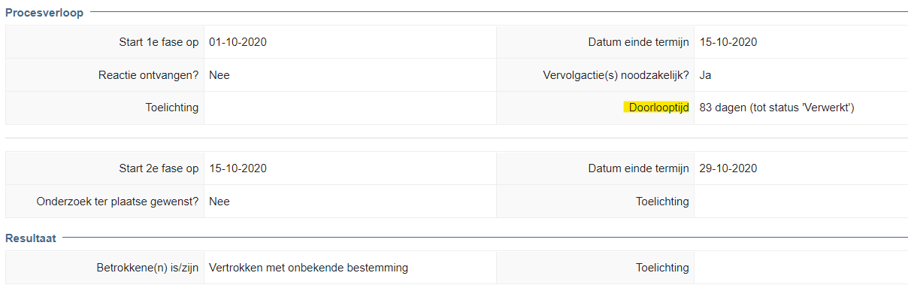
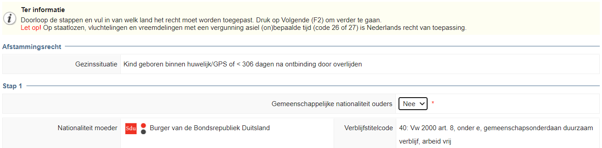

|   |                                                                                                           |   |
|---|-----------------------------------------------------------------------------------------------------------|---|
|   | Release notes                                                                                             |   |
|   | vrijBRP                                                                                                   |   |
|   | 1.27.1                                                                                                    |   |
|   |                                                                                                           |   |
|   |  |   |

Inhoudsopgave

[1.	Inleiding	3](#_Toc74051844)

[2.	Overzicht wijzigingen ten opzichte van 1.27	3](#_Toc74051845)

[3.	1e inschrijving	4](#_Toc74051846)

[4.	Adresonderzoek	4](#_Toc74051847)

[5.	Geboorte	7](#_Toc74051848)

[6.	Algemeen	8](#_Toc74051849)

# Inleiding

**Toelichting op deze release**

**Geen uitgebreide inleiding deze keer, aangezien het een release betreft die
met spoed is uitgebracht vanwege een gemelde bug in de verwerking bij het
zaaktype 1e inschrijving. Met het uitbrengen van deze (minor) release komen een
aantal andere wijzigingen direct mee. In dit document worden deze nader
toegelicht.**

# Overzicht wijzigingen ten opzichte van 1.27

De volgende onderdelen zijn toegevoegd of aangepast. Verderop worden deze nader
toegelicht. Gaat om:

-   **1e inschrijving**

    -   In versie 1.27 was deze bug opgelost: Als vestigende persoon gerelateerd
        is aan een ouder die al in de gemeente staat ingeschreven, werd bij de
        relatielegging de datum ingang familierechtelijke betrekking onterecht
        de datum van de relatielegging gevuld.

    -   Als bij-effect van bovenstaande oplossing werd bij het aanleggen van
        persoonslijsten van in te schrijven personen in categorie 02 en 03
        (ouders), als de oudergegevens gevuld werden met persoonsgegevens (geen
        standaardwaarden), de datum ingang familierechtelijke betrekking leeg
        gelaten. Wat een PL oplevert die niet voldoet aan de eisen van het
        Logisch Ontwerp. Vandaar de gepaste spoed bij het uitbrengen van deze
        release.

-   **Adresonderzoek**

    -   Extra managementinformatie. Aantallen per periode met doorlooptijd
        minder/meer dan 10 weken.

    -   Kunnen benaderen persoonslijst van personen die het onderwerp zijn van
        het adresonderzoek vanuit de zaak (en de mogelijkheid om weer terug te
        keren in de zaak).

    -   Extra parameterinstellingen om standaardwaarden toe te kennen aan
        velden.

-   **Geboorte**

    -   Duidelijkere infotekst in stap “afstamming” en de vermelding van zowel
        de code van de verblijfstitel als de omschrijving (voorheen alleen de
        omschrijving).

-   **Algemeen**

    -   Vervangen van zogenaamde native queries door JPA in de
        dashboardgegevens. Dit voorkomt een mogelijke SQL-injection. Dit issue
        was gemeld op Github:
        <https://github.com/vrijBRP/vrijBRP-Balie/issues/1>

# 1e inschrijving

Naast de algemene tekst is hierover niet veel aanvullend te melden. Het is
getest met alle mogelijke varianten bij het aanleggen van een persoonslijst
a.g.v. een 1e inschrijving en de situatie die in 1.27 was opgelost is eveneens
getest om te controleren of die fout niet is teruggekeerd door de
geïmplementeerde oplossing.

# Adresonderzoek

**Extra managementinformatie**

In het zakenregister\>dashboard in de tab “overige cijfers:

Als een periode wordt gekozen, zijn de onderste 2 regels toegevoegd:

Rechts staan dan de cijfers. Doorklikken op een regel levert de lijst met zaken
op die hieraan voldoen.

In de zaak zelf is de doorlooptijd ook terug te zien.

In het tabblad “onderzoek” is onder “procesverloop” het als volgt zichtbaar:

De termijn van 10 weken (70 dagen) komt uit de circulaire adresonderzoek. De
datum wordt berekend vanaf de datum aanvang onderzoek t/m de datum afsluiten van
het dossier (status zaak naar “verwerkt”). Ook dit is conform wat in de
circulaire staat. Als een dossier binnen 5 dagen kan worden afgehandeld, wordt
categorie 08 niet in onderzoek gezet en vermeld de doorlooptijd “geen
onderzoek”.

**Persoonslijst benaderen vanuit de zaak**

Vanuit de zaak kunnen voortaan (stap “betreft”), door te dubbelklikken op een
persoon meer gegevens worden gezien.

Dubbelklik op een persoon en de gegevens worden “uitgevouwen”, zoals bij andere
zaaktypen ook het geval is:

Door op de button “persoonslijst” te drukken kan naar de persoonslijst van deze
persoon worden gegaan.

Vanuit daar kan met de weer worden teruggegaan naar de zaak.

**Extra parameterinstellingen**

In beheer\>parameters\>adresonderzoek kunnen aanvullende parameterinstellingen
worden gebruikt:

Gaat om de onderste 3 parameterinstellingen. Let er wel op dat de onderste twee
afhankelijk zijn van “binnen 5 dagen af te handelen”. Dat komt omdat deze pas
verschijnen als “binnen 5 dagen af te handelen” op “nee” staat in het proces.
M.a.w., zet deze allemaal op “nee” of gebruik ze alledrie niet. Het alle drie op
“nee” kunnen zetten was overigens één van de eerder geuite wensen van gemeenten
m.b.t. de module adresonderzoek.

# Geboorte

**Gewijzigde infotekst en code + omschrijving verblijfstitel**

In de stap “afstamming” komt – afhankelijk van de situatie bijvoorbeeld dit er
te staan:

Of:

De toegevoegde tekst is de 2e regel van de infotekst (“Let op! …….”)

Ook is in bovenstaande afbeeldingen te zien dat de verblijfstitelcode is
toegevoegd. Die code is voor veel medewerkers een belangrijk hulpmiddel en zegt
vaak meer nog dan (alleen de) omschrijving.

# Algemeen

Kort na de publicatie van de softwarecode op Github had een ontwikkelaar een
issue gemeld met een beveiligingsrisico. Het betref een (beperkt) risico op een
SQL-injection. Zonder hier dieper op in te gaan (te technisch voor
beheerders/gebruikers) wilden we dit wel vermelden. Enerzijds omdat we blij zijn
dat iemand de software heeft onderzocht op een dergelijk risico en dit een
voorbeeld is van de meerwaarde van OpenSource-software, anderzijds omdat we het
oplossen ervan ook willen melden. Het issue zat in de functionaliteit voor het
dashboard dienstverlening. De native SQL-queries zijn vervangen door JPA.
