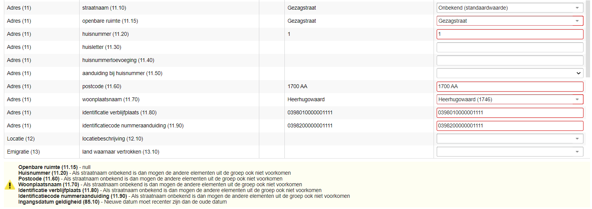
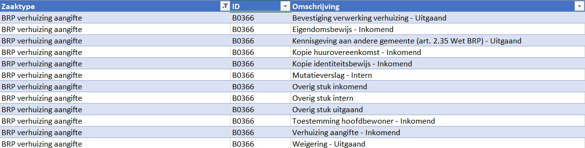

|   |                                                                                                           |   |
|---|-----------------------------------------------------------------------------------------------------------|---|
|   | Release notes                                                                                             |   |
|   | vrijBRP                                                                                                   |   |
|   | 1.27 (en PROBEV 04.3.13.04)                                                                               |   |
|   |                                                                                                           |   |
|   | (MS Word)[ReleaseNotes.docx] (PDF)[ReleaseNotes.pdf]                                                      |   |
|   |  |   |

Inhoudsopgave

[1.	Inleiding	3](#_Toc69480291)

[2.	Overzicht wijzigingen ten opzichte van 1.26	5](#_Toc69480292)

[3.	Algemeen	6](#_Toc69480293)

[4.	PL mutaties	7](#_Toc69480294)

[5.	Huwelijk/GPS	11](#_Toc69480295)

[6.	Naamskeuze	13](#_Toc69480296)

[7.	Eerste inschrijving	13](#_Toc69480297)

[8.	ZakenDMS	14](#_Toc69480298)

[9.	BSM (Berichten Service Module: Taakplanner)	19](#_Toc69480299)

[10.	PROBEV (character-applicatie)	20](#_Toc69480300)

# Inleiding

**OpenSource-gang per 22 februari gerealiseerd**

Onze BRP-applicatie (van ons allemaal) is als OpenSource gepubliceerd per 22
februari van dit jaar. Betreft nog niet alle onderdelen, maar wel al het
grootste deel van de softwarecode. Het valt samen met de introductie van de naam
vrijBRP als naam voor de applicatie. Voor de meeste gemeenten is dit in de
vormgeving van de applicatie met ingang van deze versie zichtbaar. Voor jullie
als gebruikers is er – behalve die naamsverandering – niet direct iets anders.
De applicatie is inhoudelijk hetzelfde. De OpenSource applicatie is geen aparte
applicatie, maar de applicatie die jullie allemaal goed kennen. De
OpenSource-gang past bij de uitgangspunten van Common Ground. Een beweging voor
en door gemeenten die wij volledig ondersteunen en die perfect bij ons past.
Kijk gerust eens op: <https://github.com/vrijBRP>.

**Haven-compliancy**

Een andere stap die is gezet is het Haven-compliant maken van de applicatie.
Haven is een standaard voor cloud-onafhankelijke architectuur en is eveneens een
Common Ground initiatief (<https://haven.commonground.nl/>). Het komt erop neer
dat als vrijBRP werkt in één Haven-omgeving, het in alle Haven omgevingen werkt.
Houdt in dat de applicatie op een Haven-omgeving die on-premise staat kan
draaien, maar ook in een door ons of een andere partij gehoste cloudomgeving kan
worden geplaatst.

Uniform, herbruikbaar, schaalbaar en veilig. Hierin is de afgelopen periode tijd
gestoken.

**Single-Sign-On en 2-factor authenticatie**

Een onderdeel wat vaak in één adem wordt genoemd met cloud en SaaS is
Single-Sign-On. Als wordt ingelogd op het netwerk van de gemeente is het
wenselijk dat er bij applicaties waar men toegang toe heeft niet meer apart
hoeft te worden ingelogd. Daarnaast is door het thuiswerken de behoefte aan
2-factor authenticatie toegenomen. Deze onderdelen kunnen het beste in samenhang
worden bekeken.

We zijn hier inmiddels een eind mee gevorderd. Zo is integratie met de Azure
Active Directory mogelijk (Microsoft identiteits- en toegangsbeheerservice) en
zijn we eveneens bezig met Keycloak (eenzelfde soort product, maar dan
OpenSource). Na aanmelding via zo’n service is daarna direct toegang tot de
applicatie mogelijk. In die toegangsbeheerservices kan 2-factor authenticatie
als optie ingeschakeld worden. Zo kan de gemeente dit zelf bepalen.

**Proof of Concept verhuis-API**

Met een ander bedrijf (Conduction) is een Proof of Concept (een POC) uitgevoerd
met een verhuis-API die in ’s-Hertogenbosch wordt gebruikt voor verhuizingen via
het e-loket van de gemeente. Wij konden daarbij aantonen dat we deze naadloos
kunnen gebruiken zonder dat er berichten moeten worden omgezet naar oude
StUF-varianten (of nog ouder) zoals in ’s-Hertogenbosch wel nodig is voor
Centric om een verhuizing te kunnen verwerken. We proberen wat dit soort
ontwikkelingen betreft zo vroeg mogelijk aan te haken.

**Common Ground Waardepapieren i.s.m. Haarlem**

Recent is op het vrijBRP LinkedIn kanaal een bericht hierover gepubliceerd.
[Procura](https://www.procura.nl/) plant om - in samenwerking met
[Conduction](https://www.conduction.nl/) - de Common Ground toepassing
["Waardepapieren"](https://commonground.nl/groups/view/b92e707d-fce4-486d-bb7f-e710d77a2eaa/team-waardepapieren)
te implementeren bij de gemeente Haarlem. Het gaat hierbij om het afgeven van
(in 1e instantie) uittreksels uit de BRP in de vorm van een QR-code, waarbij de
ontvangende instantie de QR-code kan gebruiken om de geldigheid te valideren. De
componenten zijn allemaal OpenSource wat prima past bij ons
[vrijBRP](https://vrijbrp.nl/) initiatief. We starten ná de Tweede Kamer
verkiezingen.

Bovenstaande ontwikkelingen zijn niet altijd direct zichtbaar of beschikbaar.
Het is alleen wel belangrijk om te weten wat er speelt en waar we ons mee bezig
houden. Soms gaat dat ten koste van iets wat we in de bestaande applicatie van
plan waren om toe te voegen of te verbeteren. Dat raakt zeker niet uit beeld,
maar duurt dan soms iets langer. De beschreven ontwikkelingen zijn wel in het
belang van iedereen. Zowel huidige gebruikersgemeenten als potentiële nieuwe
klanten. Mochten er vragen zijn hierover, dan horen we dat graag.

**  
**

# Overzicht wijzigingen ten opzichte van 1.26

De volgende onderdelen zijn toegevoegd of aangepast. Verderop worden deze nader
toegelicht. Gaat om:

-   **Algemeen**

    -   Geen controle meer op teletex-conforme tekens in zogenaamde
        tekst-area’s. Bijvoorbeeld bij adresonderzoek aantekeningen

-   **PL mutaties**

    -   Wijziging in categorie 01 wordt automatisch verwerkt bij gerelateerden
        (in de gemeente) Geldt voor zowel actualiseren (toevoegen) als
        corrigeren actuele algemene gegevens

    -   Bug opgelost. BSN niet verplicht in historie categorie 01

    -   Puntadres nu mogelijk

    -   Aktenummer en nummer reisdocument nu standaard “upper\_case”
        (hoofdletters)

-   **Huwelijk/GPS**

    -   Als een bestaande zaak wordt aangepast worden gegevens die gewijzigd
        zijn sinds de laatste keer dat aan de zaak werd gewerkt nu volledig
        bijgewerkt

-   **Naamskeuze**

    -   Check op burgerlijke staat partner is eruit gehaald

    -   Titel in processtap “Partner” gewijzigd in “Partner/andere ouder”

-   **Eerste inschrijving**

    -   Bug opgelost. Als vestigende persoon gerelateerd is aan een ouder die al
        in de gemeente staat ingeschreven, werd bij de relatielegging de datum
        ingang familierechtelijke betrekking onterecht de datum van de
        relatielegging gevuld

-   **ZakenDMS**

    -   Keuze voor documenttype bij uploaden documenten

    -   Uploaden documenten niet (meer) mogelijk als zaak is afgehandeld

-   **BSM (Berichten Service Module, of nu: Taakplanner)**

    -   Verwerken intergemeentelijke verhuizing, alleen melding bij status 0
        bestaand parkeertabelrecord

    -   Bug opgelost. Bij verwerken zaak waarbij geboorteplaats in het
        buitenland ook als NL gemeente voorkomt (Sint Maarten, Hasselt bijv.)
        wordt dit nu correct verwerkt.

**PROBEV, 04.3.13.04**

De character-applicatie is aangepast o.a. naar aanleiding van de verkiezingen om
meer controle te hebben op de handelingen die in het kiezersregister worden
uitgevoerd. **Belangrijk daarbij is dat dit een databasewijziging vereist.**

In deze release notes worden de aanpassingen nader toegelicht.

# Algemeen

De controle op teletex-conformiteit in text-area’s is opgeheven. Dit
manifesteerde zich bij bijvoorbeeld adresonderzoeken of terugmeldingen in
aantekeningvelden. Vaak kopiëren gebruikers tekst uit e-mails rechtstreeks naar
die tekst-area’s, waarbij “onder water” allerlei opmaak mee kwam. Dit
resulteerde dan in foutmeldingen bij het opslaan, waarbij het voor een gebruiker
niet zichtbaar was wat er nu precies fout aan was.

Dit soort velden staat los van verwerking in de BRP (waar de teletex tekenset op
van toepassing is). Vandaar dat nu deze controle hier vanaf is gehaald. Dit
geeft gebruikers wat meer vrijheid zonder dat dit problemen oplevert voor de
BRP.

De controle op teletex-conformiteit blijft uiteraard wel gelden voor tekstvelden
zoals adres in buitenland, documentomschrijvingen, namen etc. Deze waarden
vloeien rechtstreeks de BRP in.

**Vergelijking:**

**Voorbeeld hierboven:** hier worden deze tekens niet geaccepteerd.

En in bovenstaand voorbeeld wel.

# PL mutaties

Het werken met PL mutaties is inmiddels door een aantal gemeenten opgepakt.
Wensen en onvolkomenheden worden gelukkig gemeld. Op basis hiervan en al eerder
aangegeven logische uitbreidingen zullen ook in volgende release aanpassingen
volgen. Het is dan ook een uitgebreid onderdeel met veel regels en
uitzonderingen.

In deze release zijn de volgende verbeteringen toegevoegd:

1.  Het automatisch doorverwerken van actualiseringen en correcties naar
    gerelateerden

    1.  Opgeloste bug waardoor geen historisch record in categorie 01 kon worden
        toegevoegd zonder BSN

        1.  Mogelijkheid om puntadres te verwerken in categorie 08

            1.  Het standaard met hoofdletters (ongeacht de invoer) invoeren van
                de velden aktenummer en nummer reisdocument

                **Automatisch doorverwerken**

                Betreft het doorverwerken van mutaties die in categorie 01
                worden gedaan bij gerelateerden die actueel in de gemeente staan
                ingeschreven. Gaat om de opties “Actualiseren (toevoegen
                gegevens)” en “Correctie van actuele algemene gegevens”.

>   **Voorbeeld:**

>   

>   In het kader is te zien welke gerelateerden er zijn gevonden. Als een
>   gerelateerde in een andere gemeente woont of er is een andere reden waarom
>   die persoonslijst niet kan worden bijgewerkt, dan staat dit in het rood in
>   de kolom “opmerkingen” vermeld. Bij het verwerken wordt de categorie die
>   daar staat bij die gerelateerde persoon ook bijgewerkt met precies dezelfde
>   gegevens als in categorie 01 wordt gedaan.

>   In de log van de verwerking is dit ook zichtbaar:

>   

**  
**

>   **Opgeloste bug, toevoegen historie categorie 01 zonder BSN**

>   In andere categorieën kon dit al wel, maar in categorie 01 werd geblokkeerd
>   om een historisch record toe te kunnen voegen zonder BSN. Volgens het
>   Logisch Ontwerp moet dit mogelijk zijn en dat is nu ook zo gerealiseerd.

>   **Mogelijkheid om puntadres te verwerken in de BRP**

>   Ondanks het feit dat een puntadres niet meer in de beschrijving van de HUP
>   of het Logisch Ontwerp meer voorkomt en de RvIG het gebruik ervan afraadt,
>   volgens sommige gemeenten de pilot van de G4-gemeenten m.b.t. het gebruik
>   van een puntadres. In het gegevenswoordenboek (onderdeel LO) is de waarde
>   “.” (punt) als standaardwaarde voor de straatnaam overigens ook nog
>   opgenomen.

>   Tot nu toe was men voor het opnemen van een puntadres aangewezen op het
>   gebruik van de character-applicatie (PROBEV) om deze mutatie aan te brengen.
>   Om die belemmering weg te nemen is deze mogelijkheid nu in de PL mutatie
>   toegevoegd.

>   **Voorbeeld:**

>   

>   Ga met TAB naar de datum aanvang en vul de “verhuisdatum” in.

>   Druk weer op TAB en vul “onbekend” in bij de straatnaam (deel ervan is
>   genoeg):

>   

>   Als die waarde is geselecteerd is dit zichtbaar:

>   

>   De waarden in de rood omrande velden moeten worden leeggemaakt. Snelste is
>   om met TAB naar zo’n veld te gaan en deze met 1x backspace leeg te maken.
>   Vul bij de datum geldigheid de juiste waarde in en druk op Volgende (F2).

>   

>   Vul eventueel een reden in bij het tekstveld en sla op of verwerk meteen
>   (afhankelijk van de autorisatie).

>   **Standaard hoofdletters in velden aktenummer en nummer reisdocument**

>   Is uiteraard makkelijker qua invoer en voorkomt fouten in de BRP.

# Huwelijk/GPS

Een proces wat uiteindelijk leidt tot de voltrekking van een huwelijk of GPS en
de verwerking ervan in de BRP is vaak iets wat vaak meerdere maanden in beslag
neemt vanaf de eerste aanleg van het dossier. Om te controleren of de gegevens
van de personen die zijn betrokken bij het proces nog actueel zijn was hiervoor
een actualiseringsoptie al aanwezig. In de praktijk bleek dat deze niet alle
gegevens bijwerkte, wat tot extra werk voor de medewerker leidde. Dat niet alles
werd bijgewerkt was op zich wel te verklaren, maar het sluit niet aan bij wat de
medewerker verwacht wat er gebeurt. Vandaar dat een aanpassing is gemaakt om dit
te ondervangen.

Het constateren en bijwerken van wijzigingen is nu volledig. Ook in geval van
bijvoorbeeld erkenning van één van de partners wordt dit correct opgevangen. De
nog ontbrekende ouder wordt toegevoegd en als de naam is gewijzigd door de
erkenning, dan werkt dit ook correct door naar het scherm met naam en
naamgebruik.

**Uitgangssituatie:**

-   Partner 1 heeft 1 juridische ouder

-   Nog geen getuigen ingevuld

-   In scherm met naam(gebruik) staat bij “naam na sluiting” bij beide partners
    de huidige naam:

    

    Partner 1 wordt erkend en partner 2 krijgt een wijziging van de
    geslachtsnaam. Bij het opnieuw oppakken van de huwelijkszaak (aanpassen
    zaak) is onderstaand scherm te zien:

Er is in ieder geval al te zien dat er ten opzichte van de vorige keer een
persoon ontbreekt (de erkenner in dit geval).

Door op “Controleren (F3)” te drukken worden de gegevens bijgewerkt:

Als op “Bijwerken (F9)” wordt gedrukt:

Als dan naar de zaak wordt gegaan (F2), dan:

Zijn de hierboven vermelde gegeven bijgewerkt én is in het scherm met
“naam(gebruik)” dit te zien:

# Naamskeuze

Een pas recent toegevoegd proces ondergaat in deze release een paar wijzigingen.
Deel ervan is cosmetisch, maar een deel ook functioneel. Met de wijziging van
het laatste willen we twee dingen bereiken:

1.  Het mogelijk maken om een zaakproces akte van naamskeuze vóór de
    huwelijksvoltrekking te laten starten zodat bij de voltrekking – indien
    gewenst – de akte van naamskeuze kan laten worden ondertekend.

    1.  Het faciliteren van de mogelijkheid (die er formeel ook is) om ongehuwde
        ouders naamskeuze te laten doen.

Beide bovenstaande opties werden geblokkeerd omdat bij de partner gecontroleerd
werd of deze gehuwd is of een actueel GPS heeft. Die controle is er nu uit
gehaald.

De cosmetische wijziging (processtap heet nu “partner / andere ouder”) sluit aan
bij het tweede genoemde punt. Alleen het noemen van de “partner” dekte niet de
volledige lading.

# Eerste inschrijving

Betreft een opgelost bug. Er werd bij relatielegging met een al in de gemeente
wonende persoon onterecht de datum ingang familierechtelijke betrekking
gewijzigd. Dit is vanaf nu niet meer het geval. Deze datum houdt nu de
oorspronkelijke waarde, zoals het hoort.

**  
**

# ZakenDMS

Steeds meer gemeenten gaan gebruik maken van de zakenDMS-koppeling tussen de
BRP-applicatie en het zaaksysteem. Dit maakt dat er op dat punt ook wensen zijn
voor aanpassingen of toevoegen van functionaliteit.

In deze release zijn een tweetal aanpassingen gedaan voor zakenDMS:

1.  Het kunnen selecteren van een documenttype bij het uploaden van documenten
    bij een zaak

    1.  Het blokkeren van het kunnen uploaden van documenten bij een zaak als
        deze zaak is afgehandeld

        Het kunnen selecteren van een documenttype bij uploaden komt in de
        plaats van het sturen van een standaard documenttype wat tot nu toe de
        praktijk was. Hiervoor werd “Overig stuk inkomend” gebruikt.

        Als een documenttype moet kunnen worden geselecteerd, is het voor een
        gebruiker het meest praktisch als dit een documenttype is wat bij dat
        zaaktype hoort en niet een generieke lijst met documenttypen. Dat vergde
        de nodige aanpassingen.

        

        In Beheer\>Documenten is een tabblad toegevoegd “DMS documenttypes”.

        In het documentenoverzicht zijn kolommen toegevoegd:

        

        Die rubrieken zijn ook te vinden bij een document zelf:

        

        Alias is ervoor om naar te kunnen verwijzen. In de takenplanner (BSM)
        wordt dit bijvoorbeeld gebruikt bij het “kenmerken” van de
        zaaksamenvatting. We zullen dit vaker gaan gebruiken. Bijvoorbeeld bij
        de correspondentietaak waar nu (nog) wordt verwezen naar de documentcode
        van de te gebruiken brief. Ook voor bijvoorbeeld een e-dienst voor
        uittreksels zou zoiets kunnen. De documentcode is eigenlijk onhandig
        voor dergelijke toepassingen.

        Documenttype is een autoaanvulveld waar geput kan worden uit de waarden
        die in het tabblad “DMS documenttypes” zijn/worden toegevoegd. Dat
        kunnen bijvoorbeeld waarde uit i-Navigator zijn. Het veld met de
        documenttypes is een vervanging voor wat tot aan deze versie “DMS-naam”
        heette.

**Tabblad DMS documenttypes**

Van belang is om te weten welke documenttypes er bij welk zaaktype kunnen
voorkomen. Dat is informatie die (ook) in het zaaksysteem staat en is ingericht.
Veel gemeenten gebruiken i-Navigator als basis voor hun zaaktypecatalogus (ztc).

Daarin staat bijvoorbeeld dat bij het zaaktype “BRP verhuizing aangifte” deze
documenttypes horen:

Voorbeeld na invoer:

Als op “Nieuw (F7)” wordt gedrukt:

Bij “Omschrijving” vul je de naam van het documenttype in. Bij “Zaaktypes”
selecteer je uit de zaaktypen die in de applicatie voorkomen.

Hou er daarbij rekening mee dat “Verhuizing” in de applicatie in het zaaksysteem
is gesplitst in:

-   BRP verhuizing aangifte

-   BRP hervestiging vanuit het buitenland

-   BRP emigratie aangifte

-   BRP briefadres- of woonadresomzetting

Alle documenttypes die bij die zaken horen moete kunnen worden geüpload bij het
zaakproces “verhuizing” in de applicatie.

Zoiets geldt ook bij reisdocumenten en rijbewijzen bijvoorbeeld, waar in het
zaaksysteem een uitsplitsing in soort reisdocument en rijbewijs bestaat.

Als dan in de applicatie bij een zaak (bijvoorbeeld verhuizing) een document
moet worden geüpload, dan kan de gebruiker kiezen uit de documenttypes die bij
dat zaaktype (of meerdere zaaktypen) horen.

**Niet meer kunnen uploaden bij afgehandelde zaken**

Als een zaak is afgehandeld (eindstatus is bereikt, d.w.z. verwerkt,
geannuleerd, geweigerd), dan is het voortaan niet meer mogelijk om een document
te uploaden bij een zaak. Dit document wordt nl. niet meer uitgewisseld met het
zaaksysteem/DMS. Als het document toch bij de zaak terecht moet komen, dan moet
dit buiten de applicatie om direct naar het zaaksysteem/DMS gebeuren. Via de tab
“Zaaksysteem” is het document dan wel te raadplegen in de applicatie
(geefZaakdetails).

# BSM (Berichten Service Module: Taakplanner)

De BSM wordt nu ook wel aangeduid als “Taakplanner”. In het inlogscherm en in de
titelbalk is dit te zien:

Functioneel is de taak voor het verwerken van verhuizingen aangepast sinds
versie 1.26 is uitgekomen. Het komt regelmatig voor dat deze taak bij een
gemeente wordt afgebroken omdat bij het verwerken van een intergemeentelijke
verhuizing er nog een record in de parkeertabel voorkomt van die persoon. Dat
record moest dan worden bekeken om te zien wat er precies aan de hand was. Het
kon zijn dat de verhuizing twee keer is verwerkt (2 zaken of dezelfde zaak twee
keer omdat de status was teruggezet of niet was bijgewerkt), of – en dat komt
vaker voor – dat er nog een parkeertabelrecord in stond van een vorige
verhuizing van die persoon.

Deze taak in de taakplanner is nu zo aangepast dat alleen in het geval van de
aanwezigheid van een parkeertabelrecord met status 0 (nul), de taak zal worden
afgebroken. De status 0 wil zeggen dat het een nieuw aangemaakt record is,
waarbij op basis van dit record nog geen bericht is gemaakt (Ii01/Ji01). Het
gaat dan echt om een dubbele verwerking van ofwel dezelfde zaak of 2 zaken.

Is er een record aanwezig in de parkeertabel met een andere status dan 0, dan
wordt de zaak gewoon verwerkt en wordt dus een nieuw parkeertabelrecord
aangemaakt. Het resultaat is dan dat deze taak minder vaak zal worden
afgebroken. Het enige (kleine) risico wat wordt genomen is een situatie waarbij
een verhuizing meerdere keren wordt verwerkt (1 of meerdere zaken) met
bijvoorbeeld een dag ertussen. De eerste verhuizing is dan in de cyclus nog niet
afgerond. Er zal dan een nieuwe cyclus worden gestart, die zal leiden tot een
foutbericht in het berichtenverkeer (If01/Jf01). Die kans is klein en het kan
niet leiden tot een dubbele registratie in de BRP.

**Opgeloste bug: buitenlandse plaatsnaam werd verwerkt als Nederlandse
gemeente**

Bij de verwerking door de taakplanner (BSM) van zaken zoals bijvoorbeeld een
huwelijk, geboorte, 1e inschrijving of PL mutatie werd, als een buitenlandse
plaatsnaam (geboorteplaats, huwelijksplaats etc.) ook als Nederlandse gemeente
voorkomt, de Nederlandse gemeentecode op de persoonslijst verwerkt in combinatie
met het land (niet Nederland).

Het vervelende daaraan is dat dit voor een gebruiker niet zichtbaar is, omdat
niet de code wordt getoond, maar de omschrijving en die ziet er natuurlijk
correct uit.

Voorbeelden hiervan zijn bijvoorbeeld “Sint Maarten” en “Hasselt”. Er zullen er
mogelijk nog wat meer zijn die hieraan voldoen.

De verwerking in de taakplanner is nu zodanig aangepast dat dit niet meer kan
voorkomen.

# PROBEV (character-applicatie)

De wijzigingen die zijn aangebracht sinds de release van versie 04.3.13.03
betreffen grotendeels wijzigingen aan de hand van de laatstgehouden verkiezingen
en met het oog op verkiezingen volgend jaar.

Gaat om deze wijzigingen **(let op: update vereist een databasewijziging)**

-   Alle acties op het kiesregister worden gelogd in de database

-   Volgorde van acties wordt harder gecontroleerd (n.a.v. die log)

-   Er wordt vastgelegd wanneer een entry in het kiesregister wordt toegevoegd
    of aangepast

-   Correctie systeemoptie voor afdrukken stembureau op documenten

-   Afvangen waarschuwing bij afdrukken document direct na opvoeren in
    kiezersregister

-   Bij verwijderen PL wordt ook het kiezersregister voor dat a-nummer nu
    opgeschoond

Bij de afgelopen verkiezingen waren wijzigingen doorgevoerd voor o.a. het
splitsen van het kiezersbestand in een deel 70+ en 70-. Hierin was een fout
geslopen waardoor personen die 70 jaar werden op de verkiezingsdag ten onrechte
geen stempluspas (voor stemmen per brief) hebben gehad.

In Sittard-Geleen is (gedeeltelijk) een verschil geconstateerd in de nummering
in het aan de drukker gestuurde bestand en de nummering in het kiezersregister.
Door ontoereikende logging kon geen exacte oorzaak worden aangewezen. Bij andere
gemeenten is geen dergelijke afwijking aangetroffen.

Daarnaast was er een wens om in het kiezersregister bij een persoon te kunnen
zien wie (welke gebruiker) een vervangende stempas etc. heeft afgegeven en
wanneer.

Deze wijzigingen zijn nu aangebracht. Het is overigens zo dat bij de
Gemeenteraadsverkiezingen er waarschijnlijk niet weer wordt teruggekeerd naar
wat voorheen gebruikelijk was. Een deel van de wijzigingen die bij de Tweede
Kamer verkiezingen zijn geïntroduceerd zullen (wellicht in gewijzigde vorm)
blijven.

Voor die tijd zal de applicatie hiervoor dus zeker nog een update ontvangen.
Mogelijk is dan een deel van de functionaliteit hiervoor in de webapplicatie
beschikbaar.

**Andere wijzigingen (programmatuur en applicaties)**

-   Correcte ondersteuning voor diakrieten op beschrijving gebruikersnaam

-   Duidelijker foutmelding bij kritieke fout in berichtenverkeer

**Scripts en reports**

-   Bewoond.pl kan nu selecteren op huisnummer

-   Afvangen fout bij gebruik nieuwe velden in oude RPT-scripts

**Tooling**

-   Woningkaart kan selecteren op peildatum (wk.pl)

Voorbeeld logging in kiezersregister:

In de database-logging is te zien welke gebruiker de bewerking heeft gedaan.
