|   |                                                                                                           |   |
|---|-----------------------------------------------------------------------------------------------------------|---|
|   | Release notes                                                                                             |   |
|   | vrijBRP                                                                                                   |   |
|   | 1.29 (en PROBEV 04.3.13.06)                                                                               |   |
|   | [MS Word](ReleaseNotes.docx) [PDF](ReleaseNotes.pdf)                                                      |   |
|   |  |   |

Inhoudsopgave
=============

[1. Inleiding 3](#inleiding)

[2. Overzicht wijzigingen ten opzichte van 1.28 3](#overzicht-wijzigingen-ten-opzichte-van-1.28)

[3. Uitgelichte onderwerpen 6](#uitgelichte-onderwerpen)

Inleiding
=========

**Toelichting op deze release**

Deze release bevat een aantal belangrijke wijzigingen ten opzichte van
1.28 (de laatste uitgebrachte algemene release). Hieronder een overzicht
van de wijzigingen met een beknopte toelichting. Verderop in dit
document wordt per wijziging een uitgebreidere toelichting gegeven. Deze
release valt samen met een release van PROBEV (Character-applicatie). Er
is geen afhankelijkheid tussen beide releases voor wat betreft de
installatie.

Overzicht wijzigingen ten opzichte van 1.28
===========================================

De volgende onderdelen zijn toegevoegd of aangepast. Verderop worden
deze nader toegelicht. Gaat om:

-   **ZakenDMS**

    -   Functionaliteit toegevoegd voor het aanleggen van een "voorraad"
        zaakID's die uit het zaaksysteem worden opgehaald. Is toegevoegd
        om ervoor te zorgen dat als het zaaksysteem (tijdelijk) niet
        bereikbaar is de (e-)dienstverlening ongestoord kan blijven
        doorgaan.

-   **VOG**

    -   Toegevoegd screeningsprofiel

-   **Zoekscherm in processen uitgebreid**

    -   Zoekscherm in processen uitgebreid met extra velden voor meer
        flexibiliteit bij zoeken van personen in de BRP.

-   **Klappergegevens, extra zoekopties en opmerkingenveld**

    -   Meer flexibiliteit bij zoeken en extra veld kan gebruikt worden
        voor extra informatie (in geval van Nijmegen verwijzing naar
        aktenummer/datum uit oude applicatie).

-   **Logging inlogpogingen met SSO**

    -   Bij inloggen via Azure werd de inlogpoging niet gelogd. Nu wel.

-   **Opslag bestanden verlopen reisdocumenten op filebrowser per map op datum**

    -   Is voor Cloudgebruikers (voor nu Nijmegen). De bestanden worden
        opgeslagen in een mapje met de huidige datum zodat je ze uit
        elkaar kunt houden. Bovendien zijn ze nu benaderbaar via een
        webinterface.

-   **Openen applicatieonderdelen vanuit portaal in nieuw tabblad**

    -   Is voor Cloudgebruikers (voor nu Nijmegen). Bij aanklikken tegel
        met applicatieonderdeel wordt nu standaard geopend in een nieuw
        tabblad. Dit is gebruikersvriendelijker en het portaal blijft
        daarmee beschikbaar.

-   **Aangepaste BAG-api**

    -   De BAG-api combineert 2 webservices van pdok. In die webservices
        wordt verschillend omgegaan met de rubriek huisnummertoevoeging
        (qua naamgeving). Dit leverde problemen op bij externen die de
        api aanroepen.

-   **Fix voor niet (meer) goed werkende exportfunctie naar Excel**

    -   De export van tabellen naar Excel functioneerde niet meer. Er is
        nu een export naar CSV met komma (Excel CSV) en eentje naar CSV
        met puntkomma (Normale CSV). Het eerste kan direct worden
        geopend met MS Excel.

-   **Issue(s) met gebruik woonplaats in applicatie opgelost**

    -   Op verschillende plekken in de applicatie ondervinden gebruikers
        problemen met de rubriek woonplaats. Bijvoorbeeld bij
        adresonderzoek (externe bron, verdwijnende woonplaats), maar ook
        in andere processen kwamen issue voor (niet tonen bij nieuwe
        adres bij verhuizing etc.).

        Dit is nu opgelost.

-   **Issue met landelijke tabellen (personen-ws) opgelost**

    -   Hield verband met het issue met woonplaatsen. Het oplossen
        daarvan had onbedoeld tot gevolg dat de tabellen in personen-ws
        niet goed konden worden bijgewerkt (ook niet via importeren).
        Dit is verholpen.

-   **Zoeken woningkaart**

    -   De kolommen met de geslachtsaanduiding en de geboortedatum zijn
        visueel naar links verplaatst. Door gebruik van grote schermen
        viel de uitlijning naar uiterst rechts buiten het blikveld van
        de gebruiker.

-   **Uitbreiding mogelijkheden planning taken en aanroepen ervan**

    -   Betreft de beheerapplicatie (webomgeving). Mogelijkheid om meer
        taken te plannen, zoals bijvoorbeeld goedkeuren, controles etc.

    -   Toegevoegde REST api aan beheerapplicatie om taken te kunnen
        aanroepen

-   **Wijziging in dossier-api**

    -   In verband met e-dienst verhuizen in Sittard-Geleen (met
        Kodision). Postcodeletters worden met hoofdletters opgeslagen.

-   **Reisdocumenten, controle titel/predicaat**

    -   Sinds de laatste LO-wijziging beginnen titels en predicaten
        voortaan met een kleine letter. De controle in de applicatie van
        de RAAS-berichten ging nog uit van een verplichte hoofdletter.
        Dit is nu aangepast.

-   **Tabel documentomschrijvingen toonde geen diakrieten**

    -   Ze staan wel in de database, maar werden niet getoond op het
        scherm. Dat leverde verwarring op. Dit is nu gefikst.

-   **Berichtenverkeer**

    -   Geldt voor zowel de webomgeving (beheer en berichtenverkeer) als
        in PROBEV (Character-applicatie): als verwijsgegevens deels
        afwijken van een ontvangen PL uit het berichtenverkeer worden de
        verwijsgegevens verwijderd als de ID-nummers overeenkomen.
        Voorheen vergde dit een handmatige actie van de gebruiker.

    -   Als een PL met een nog lopend onderzoek in categorie 08
        binnenkomt wordt dit onderzoek voortaan automatisch beëindigd.

-   **Zaken markeren als favoriet**

    -   Idem als bij personen wat al gebruikelijk was, is dit nu ook
        mogelijk bij zaken.

-   **Geboorte, ontbrekende nationaliteitsgegevens bij vader/duomoeder**

    -   Bij het vastleggen van een geboortezaak (via e-dienst of via de
        applicatie zelf) werd in een specifieke situatie (geboorte na
        erkenning ongeboren vrucht) de nationaliteit van de
        vader/duomoeder niet altijd opgehaald. Dit is verholpen.

-   **Gebruikers als behandelaar kunnen koppelen aan zaken**

    -   Is in eerste instantie bedoeld als fix voor het onderscheid
        kunnen maken tussen nieuwe zaken uit het e-loket en bestaande
        zaken die al zijn bekeken en waar qua zaakstatus geen
        onderscheid is.

-   **PL mutaties, afdrukken per categorie**

    -   Voor gebruikers is het afdrukken van een categorie prettig om
        voorafgaand aan een ingewikkelde actualisering/correctie dit te
        kunnen analyseren en te bewerken voordat de
        actualisering/correctie wordt uitgevoerd.

-   **Goedkeuren mutaties vanuit de balieapplicatie**

    -   Functionaliteit om snel mutaties goed te keuren om eventuele
        extra mutaties direct erna te kunnen aanbrengen.

-   **Zakenregister, meer inzicht in problemen bij zaakverwerking**

    -   Invulling van behoefte om los van de taakplanner waarvoor niet
        elke gebruiker is geautoriseerd, problemen met verwerking
        zichtbaarder te maken.

Uitgelichte onderwerpen
=======================

Een aantal beschreven onderdelen spreken voor zichzelf of zijn niet
eenvoudig nader uit te leggen (vanwege de technische aard van de
wijziging). Betreffen ook vaak wijzigingen die niet direct de
gebruikerservaring raken. Vermeldenswaardig zijn deze items:

**ZakenDMS -- voorraadfunctie**

Uiteraard allen relevant bij gebruik van de ZakenDMS-koppeling.

Het komt voor dat een zaaksysteem tijdelijk niet bereikbaar is, om wat
voor reden dan ook. Als er geen zaakID kan worden opgehaald, dan
betekent dit voor de e-dienstverlening dat zaken (meestal) niet kunnen
worden opgeslagen in de applicatie (en het bericht later opnieuw moet
worden aangeboden) en voor de reguliere dienstverlening betekent dit in
de praktijk vaak dat men de ZakenDMS koppeling tijdelijk uitschakelt
omdat veel processen beginnen met het ophalen van een zaakID.

Deze nieuwe functionaliteit ondervangt dit. Een taak in de taakplanner
zorgt voor het ophalen van een ingesteld aantal zaakID's en put bij het
ophalen van zaakID's voor zaken eerst uit deze voorraad. De voorraad
wordt steeds aangevuld.

In de zaken-dms configuratie in de taakplanner moet het volgende worden
toegevoegd bij de properties:

```
<properties id="zkn0310.zkndms.genereerzaakidspool">
  <property id="poolomvang" value="35"/>
  </properties>
<jobs>
  <job cron="0 * * * * ?" id="job.zkn0310.zkndms.genereerzaakidspool" maxFailedCycles="3" maxRetries="1" retrySleep="5000" taskSleep="0">
  <description>Vul pool met zakenidentificaties</description>
  <properties ref="zkn0310.zkndms"/>
  <properties ref="zkn0310.zkndms.genereerzaakidspool"/>
  <tasks>
    <task id="zkn0310.zkndms.genereerzaakidspool" threads="1" version="1.0"/>
    </tasks>
  </job>
```

De poolomvang in bovenstaand voorbeeld is 35. De omvang zal afhangen van
de grootte van de gemeente, maar is dus aanpasbaar. De taak draait elke
minuut (voor aanvullen van de voorraad tot het niveau van de
poolomvang). Het is bij installatie belangrijk dat dit correct gebeurt.
Voor de gemeenten die dit betreft, graag dit in overleg met ons
uitvoeren. Er moet nl. ook nog een pad worden toegevoegd naar de map
waar de zaakID's is in worden opgeslagen. Dat doen wij bij installatie,
maar voor wie het zelf doet (Haarlem):

In `<vrijbrp installatie map>/procura/applicaties/stuf/config/config.json` moet worden toegevoegd:

```
"zaakIdsPool": {
  "path": "<voer hier pad in>"
  }
```

**VOG -- screeningsprofiel**

Betreft het screeningsprofiel met nummer 97 Beveiliging
burgerluchtvaart. Dit gaat in per 1 juni 2022, maar is ons helaas pas op
25 mei medegedeeld door Justis.

**Zoekschermuitbreiding**

Oud:

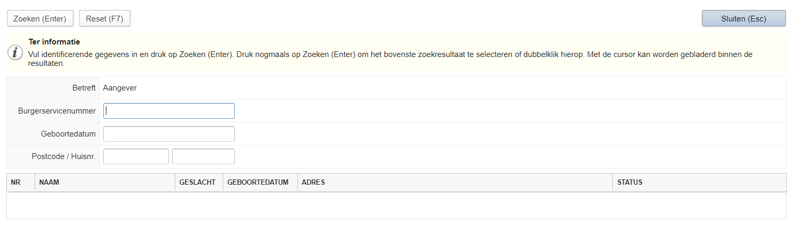

Nieuw:

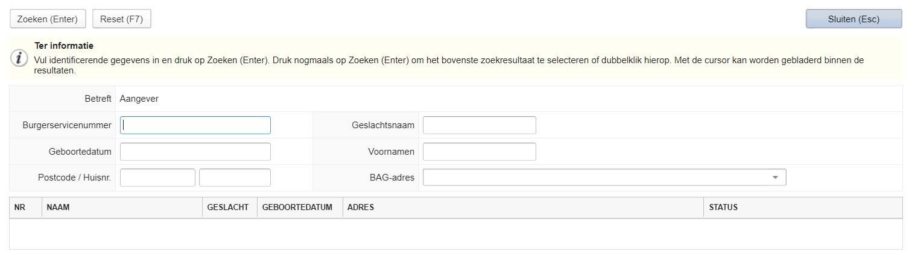

Duidelijk onderscheid en hiermee meer armslag voor medewerkers bij
zoeken.

**Klappergegevens**

Oud:

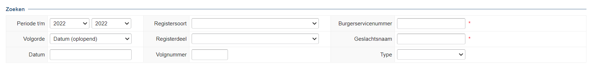

Nieuw:

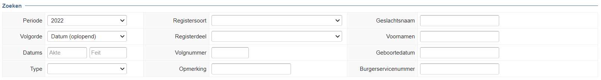

Ook hier een duidelijk onderscheid met meer zoekmogelijkheden ook als
het aktenummer niet bekend is.

**Opslag bestanden in filebrowser (portaal)**

Portaal:

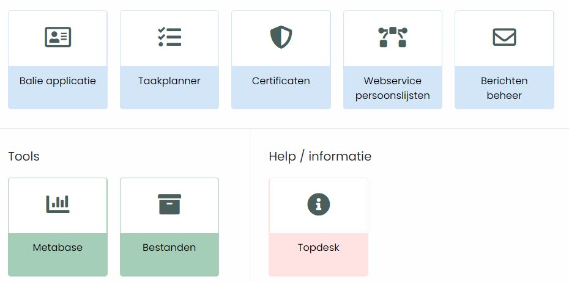

De tegel "Bestanden" leidt naar de filebrowser.

**Zaak als favoriet markeren**

Werkt vrijwel hetzelfde als markering bij personen:

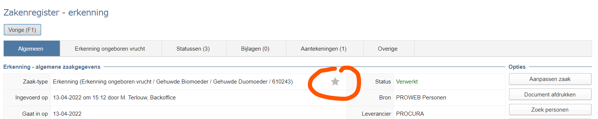

Door de "ster" aan te klikken wordt deze geel, net als in een browser
vaak gebruikt wordt.

In het zakenregister is een favoriet dan hier terug te vinden:

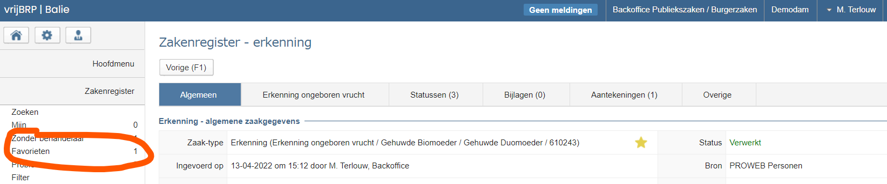

**Gebruiker als behandelaar koppelen aan zaak**

Zoals aangegeven is dit in eerste instantie een oplossing voor gevallen
waarbij een zaak die nieuw binnen is gekomen uit het e-loket eenzelfde
status heeft als een nog niet volledig doorlopen zaakproces van
hetzelfde type die ofwel eerder uit het e-loket al is binnengekomen
ofwel in de applicatie zelf is aangemaakt.

Voorbeelden hiervan:

1.  Huwelijkszaak uit e-loket met status incompleet. Dit ten opzichte
    van een al eerder binnengekomen zaak uit het e-loket of een in de
    applicatie aangemaakte zaak. Allemaal met de status incompleet. Het
    is voor gebruikers lastig onderscheid te maken. Welke is de nieuwe
    zaak en welke is eerder al bekeken.

2.  Verhuiszaak met eenzelfde constructie (is mede afhankelijk van welk
    statusverloop een gemeente hanteert).

    De oplossing is niet gezocht in het toevoegen van (nog) meer
    statussen, maar door het kunnen koppelen van een behandelaar aan een
    zaak. Op deze manier kan onderscheid gemaakt worden tussen nieuw
    binnengekomen zaken (nog geen behandelaar) en al beoordeelde zaken
    (wel een behandelaar.

    Dit heeft ook bijkomende voordelen (overzicht van "mijn zaken"
    bijvoorbeeld). Mogelijk dat -- afhankelijk van het gebruik en wensen
    daarbij -- deze oplossing nog wordt verfijnd.

    ***Instelling in beheer:***

    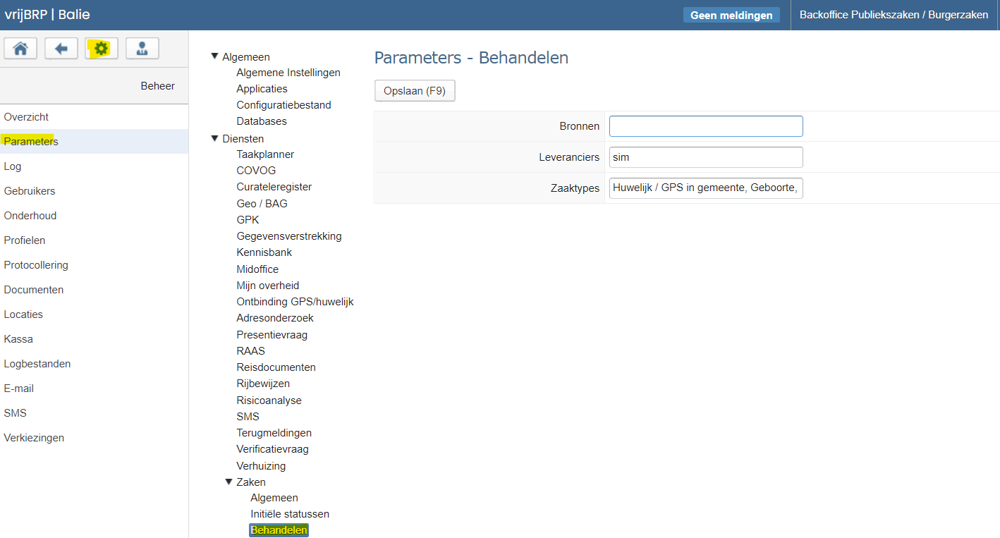

    Zoals het er nu in staat kun je zaaktypen combineren met 1 of
    meerdere leveranciers en/of bronnen. Als je meerdere leveranciers
    gebruikt (of bronnen), dan deze scheiden met een komma. De zaaktypen
    kunnen uit een lijst worden geselecteerd.

    Voor de 2 beschreven voorbeelden zou in ieder geval ingesteld moeten
    worden:

1.  E-dienst huwelijk: leverancier = sim, zaaktype = Huwelijk / GPS in
    gemeente

2.  E-dienst verhuizen: leverancier = Kodision, zaaktype = Verhuizing

Verder moet in het profiel van een gebruiker in ieder geval "inzage" en
"muteren" als acte zijn gekoppeld.


***Gebruik in applicatie:***

Voorbeeld is met een geboortezaak (e-loket), maar het principe is
hetzelfde.

Een zaak die vanuit het e-loket binnenkomst (in dit geval dus een
geboortezaak) en waarvan is ingesteld in de parameter zoals hiervoor
beschreven dat deze hieronder valt (leverancier = sim, zaaktype is
geselecteerd), dan komt deze binnen in het zakenregister zoals alle
andere zaken, maar daarnaast is deze ook hier terug te zien
(zakenregister):

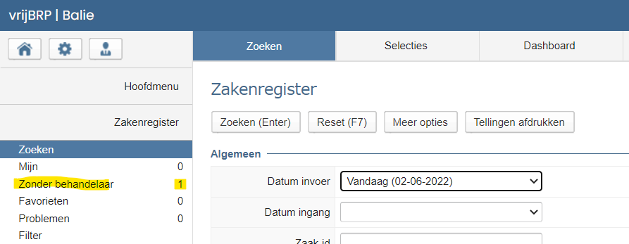

De parameter bepaald dus welke zaken daarin (zonder behandelaar) terecht
komen.

Klik op de regel "Zonder behandelaar". Dan wordt een lijst getoond met
zaken die voldoen aan de parameterinstelling én geen behandelaar hebben.

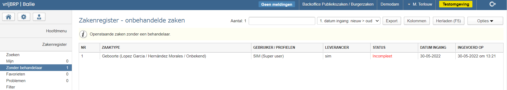

Dat maakt dan het onderscheid tussen zaken die via de applicatie (balie)
zijn aangemaakt (vallen buiten de parameterinstelling).

Als vervolgens de zaak wordt bekeken:

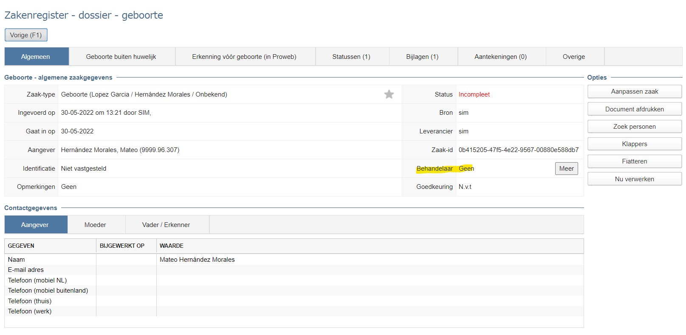

Met de button "Meer" kan een behandelaar worden gekoppeld. Dat kan ook
een andere gebruiker zijn (je kunt een andere gebruiker als behandelaar
koppelen). Als je als gebruiker zelf de behandelaar bent, kun je ook op
"Aanpassen zaak" drukken. Dit is de meest gangbare vervolgstap.

Dan is het volgende zichtbaar:

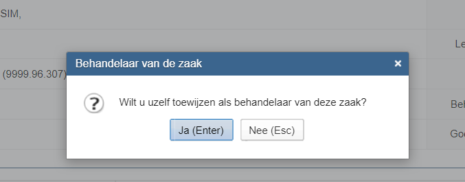

Als op "Ja (Enter)" wordt gedrukt, dan gaat deze zaak weg bij "Zonder
behandelaar" en komt deze bij "Mijn" te staan:

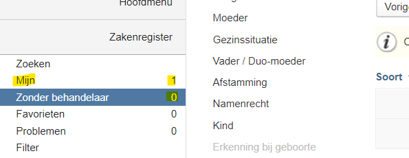

Het toekennen van behandelaars is vrijelijk te gebruiken. Dat hoeft niet
beperkt te worden tot de zaaktypen/bron combinatie die in de parameters
is opgenomen.

In het zakenregister, zoeken, meer opties (button) is "Behandelaar" ook
als zoekterm toegevoegd.

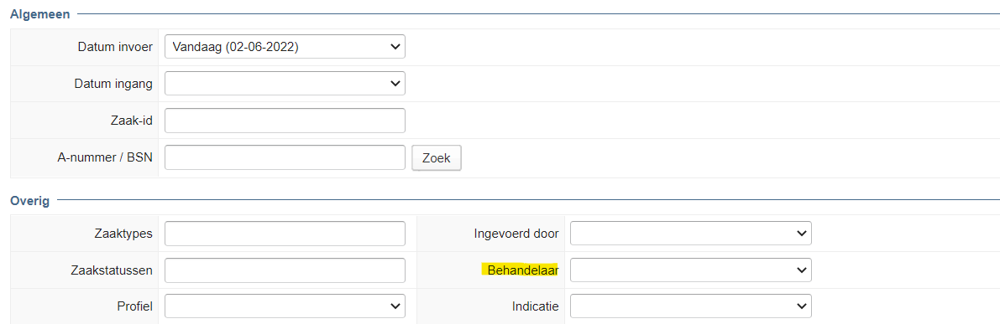

Denk er wel aan dat in het zakenregister bij "Geen behandelaar" ALLEEN
de zaken zonder behandelaar worden getoond die voldoen aan wat in de
beschreven parameter is ingesteld.

Bij "Mijn" komt alles te staan waar jij als gebruiker als behandelaar
aan bent gekoppeld.

**PL mutaties, afdrukken per categorie**

Vanuit het onderdeel PL mutaties is het nu mogelijk om per categorie (en
bij categorie 04, 05, 09 en 12 per set) een categorie af te drukken. Dit
helpt een gebruiker bij het kunnen actualiseren/corrigeren. Zeker in
geval van ingewikkelde gevallen.

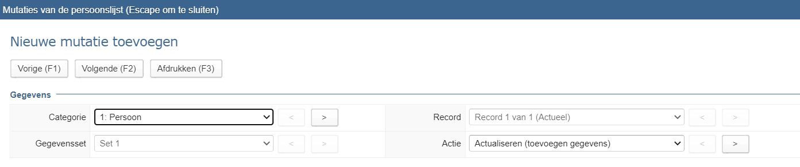

De categorie (en evt. set) die is geselecteerd wordt afgedrukt als op
"Afdrukken (F3) wordt gedrukt.

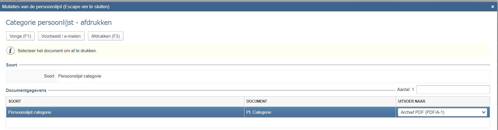

Afdrukvoorbeeld:

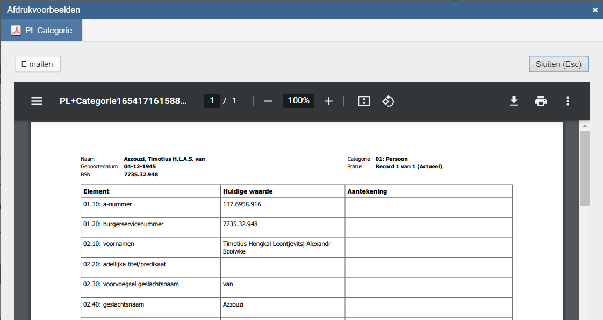

Boven een afdruk staat op welke persoonslijst deze betrekking heeft (en
welke categorie). Een kolom aan de rechterkant geeft ruimte voor
aantekeningen.

De afdruk is ruim van opzet met 1 categorie-record per pagina. Onderaan
de pagina staat welke gebruiker de afdruk heeft gemaakt en wanneer (om
verwarring bij de printer te voorkomen).

**Goedkeuren mutaties vanuit de balieapplicatie**

Het goedkeuren van mutaties vanuit de webapplicatie kon tot nog toe
alleen via de beheerapplicatie. Dat is niet wenselijk en werkt niet
efficiënt.

Er is nu functionaliteit toegevoegd om het vanuit de balie-applicatie
bij de PL mutaties te doen.

Een gebruiker die dit moet kunnen doen moet de volgende actie gekoppeld
hebben staan in zijn/haar profiel:

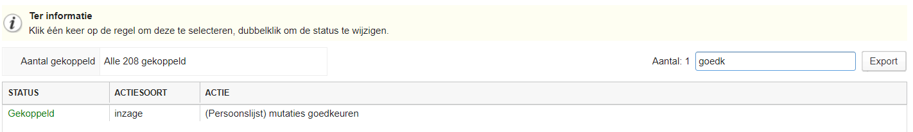

In de applicatie is het vervolgens hier te vinden:

1.  Druk op PL-mutaties

    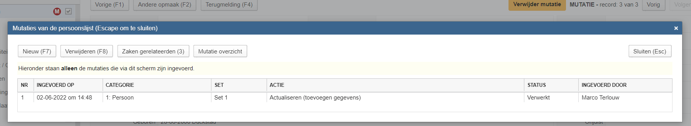

    Als voorbeeld is een PL-mutatie uitgevoerd, maar ook als via het
    verwerken van een andere zaak een mutatie op de PL terecht is
    gekomen is dit de manier om te gaan goedkeuren.

2.  Druk op de button "Mutatie overzicht".

    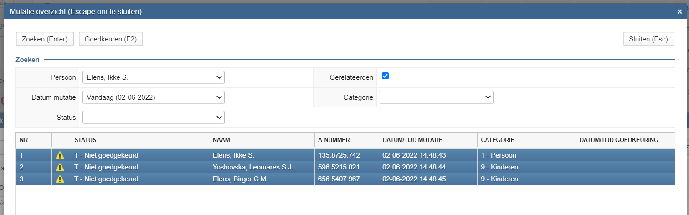

    Standaard zijn de nog niet goedgekeurde mutaties zichtbaar van de
    geselecteerde persoon én bij gerelateerden in de gemeente. Deze
    regels zijn standaard ook allemaal geselecteerd. Door op "Goedkeuren
    (F2)" te drukken worden deze goedgekeurd (en kan eventueel een
    nieuwe mutatie op dezelfde categorie worden gedaan).

Het getoonde scherm geeft ook meer mogelijkheden voor het zoeken en
goedkeuren van mutaties. Er kan van een andere persoon de mutatie worden
goedgekeurd door een andere a-nummer in te voeren (selecteer "anders" en
vul een a-nummer in). Er kan op dag worden gezocht en goedgekeurd
(zonder zoeken van een persoon), etc.

**Zakenregister, meer inzicht in problemen bij zaakverwerking**

In het zakenregister, op de plek waar ook "Zonder behandelaar" en "Mijn"
staat, is ook een rubriek "Problemen" te vinden. Soms lukt de verwerking
van een zaak door de taakplanner niet. De beheerder krijgt daarvan een
bericht en deze heeft toegang tot de taakplanner. Dat geldt in de regel
niet voor alle gebruikers.

Om toch meer inzicht te geven aan gebruikers is dit in het zakenregister
zichtbaar gemaakt:

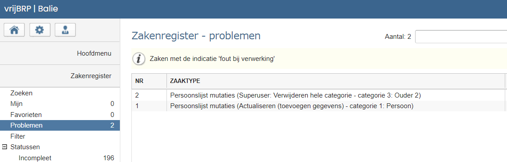

In de aantekening bij een zaak kan gezien worden wat het probleem is bij
de verwerking. Als het probleem is opgelost en de zaak verwerkt kan
worden of verwerkt is, dan moet deze zaak nog uit deze lijst worden
gehaald. Dat werkt als volgt:

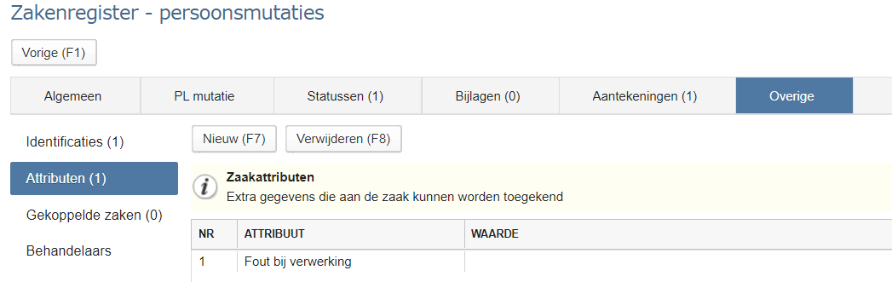

Kijk in het tabblad "Overig" en daar bij "Attributen".

Klik op de regel "Fout bij verwerking" en druk op Verwijderen (F8).

Voorstelbaar is dat bij een volgende release het attribuut automatisch
wordt verwijderd als de zaak een eindstatus heeft gekregen (verwerkt,
geweigerd, geannuleerd).
